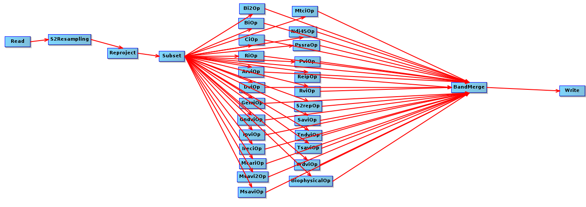

## Sentinel-2 L2A post processing using snap ###

- The XML file was build using the [SNAP](https://earth.esa.int/eogateway/tools/snap) graph builder and can be read in the same way.

- The bash script apply the XML post processing script to every Sentinel-2 L2A product in a folder.